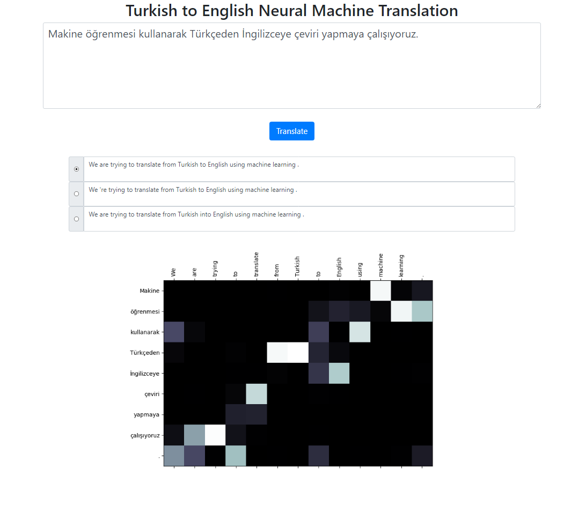

# Neural Machine Translation

This repository implements a Turkish to English Neural Machine Translation system using Seq2Seq + Global Attention model.

# Examples


# Dataset

The dataset for this project is taken from [here](http://opus.nlpl.eu/). I have used the [Tatoeba](http://opus.nlpl.eu/Tatoeba-v20190709.php) corpus. I have deleted some of the duplicates found in the data. But there are some examples left since there can be multiple translations for the same sentence. I also pretokenized the dataset. Finalized version can be found in [data](https://github.com/snnclsr/nmt/tree/master/tr_en_data) folder.

### Tokenization

* For tokenizing the Turkish sentences, I've used the nltk's [RegexpTokenizer](http://www.nltk.org/api/nltk.tokenize.html?highlight=regexp#nltk.tokenize.regexp.RegexpTokenizer). 

```python
    puncts_except_apostrophe = '!"#$%&\()*+,-./:;<=>?@[\\]^_`{|}~'
    TOKENIZE_PATTERN = fr"[{puncts_except_apostrophe}]|\w+|['\w]+"
    regex_tokenizer = RegexpTokenizer(pattern=TOKENIZE_PATTERN)
    text = "Titanic 15 Nisan pazartesi saat 02:20'de battı."
    tokenized_text = regex_tokenizer.tokenize(text)
    print(" ".join(tokenized_text))
    # Output: Titanic 15 Nisan pazartesi saat 02 : 20 'de battı .
    # This splitting property on "02 : 20" is different from the English tokenizer.
    # We could handle those situations. But I wanted to keep it simple and see if 
    # the attention distribution on those words aligns with the English tokens.
    # There are similar cases mostly on dates as well like in this example: 02/09/2019
```

* For tokenizing the English sentences, I've used the spacy's English model.

```python
    en_nlp = spacy.load('en_core_web_sm')
    text = "The Titanic sank at 02:20 on Monday, April 15th."
    tokenized_text = en_nlp.tokenizer(text)
    print(" ".join([tok.text for tok in tokenized_text]))
    # Output: The Titanic sank at 02:20 on Monday , April 15th .
```

### Format

Turkish and English sentences are expected to be in two different files.

```
file: train.tr
tr_sent_1
tr_sent_2
tr_sent_3
...

file: train.en
en_sent_1
en_sent_2
en_sent_3
...
```

# Train

Please run `python train.py -h` for the full list of arguments.

```
Sample usage:

python train.py --train_data train.tr train.en --valid_data valid.tr valid.en --n_epochs 30 --batch_size 32 --embedding_dim 256 --hidden_size 256 --num_layers 2 --bidirectional --dropout_p 0.3 --device cuda
```

# Flask App

For running the application locally, run:

```
python app.py
```

Make sure that your model paths in the `config.py` file is properly defined.

# Improvements

* Using subword units (for both Turkish and English)
* Different attention mechanisms (learning different parameters for the attention)

# References

* Skeleton code for this project is taken from the [Stanford's NLP Course: CS224n](http://web.stanford.edu/class/cs224n/)

